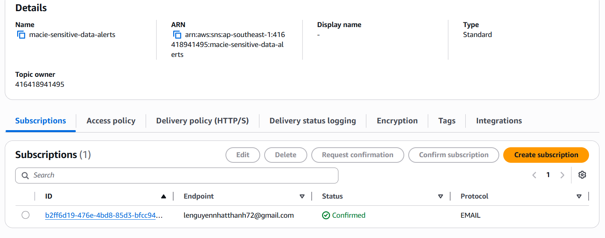
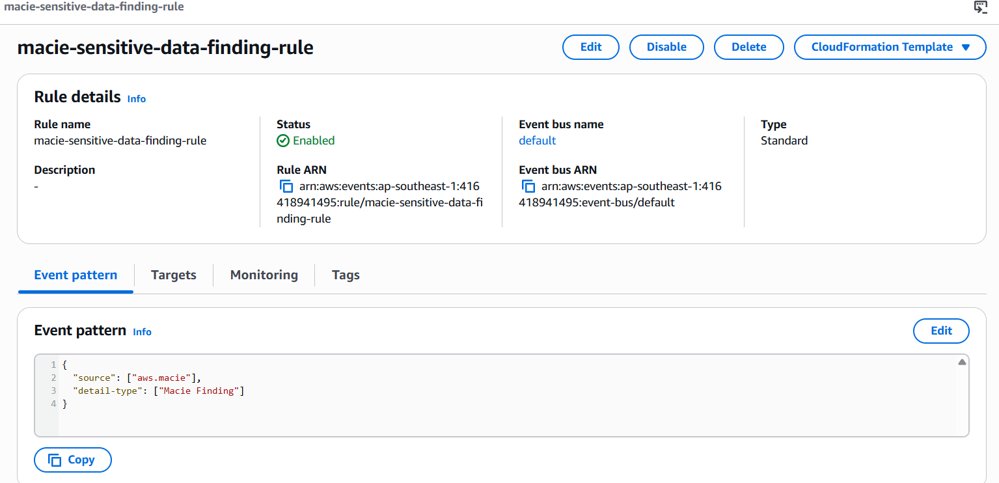
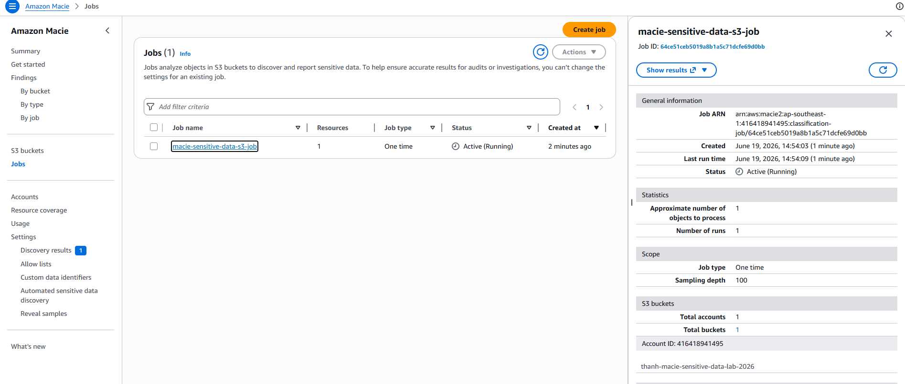
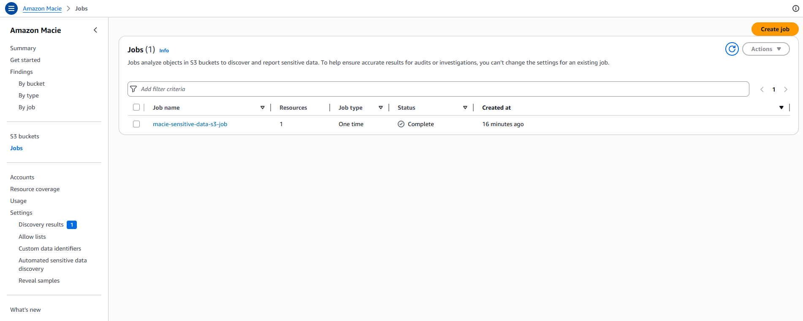
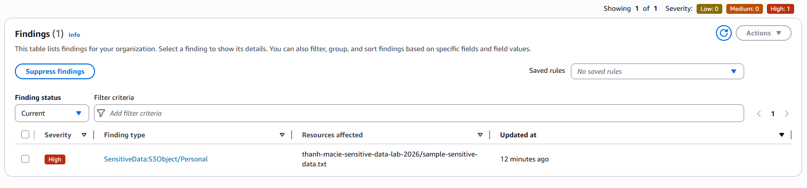
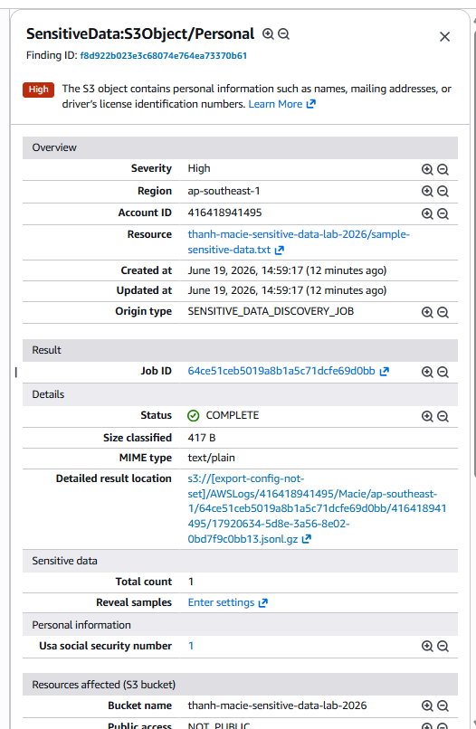

# EVIDENCE - PHÁT HIỆN DỮ LIỆU NHẠY CẢM TRONG S3 BẰNG AMAZON MACIE

## Người thực hiện

- Họ tên: Nguyễn Đăng Khôi
- Xbrain ID: XB-DN26-058
## 1. Mục tiêu

Thiết lập Amazon Macie để phát hiện dữ liệu nhạy cảm trong Amazon S3 bucket và gửi email cảnh báo thông qua Amazon EventBridge và Amazon SNS.

Luồng hoạt động:

```text
Sample files
     ↓
Amazon S3 Bucket
     ↓
Amazon Macie Job
     ↓
Macie Finding
     ↓
Amazon EventBridge Rule
     ↓
SNS Topic
     ↓
Email Notification
```

---

## 2. Các bước thực hiện

### Bước 1: Tạo S3 Bucket và Upload sample files

* Screenshot S3 Bucket


* Screenshot file sample


---

### Bước 2: Tạo SNS Topic và Email Subcription

* Screenshot SNS Topic.


* Screenshot SNS Email Subscription


---

### Bước 3: Tạo EventBridge Rule kết nối với Macie Finding


* Screenshot EventBridge Rule Pattern


* Screenshot EventBridge Rule & SNS Topic


---

### Bước 4: Bật Amazon Macie

Đã bật Amazon Macie tại Region:

* Screenshot Amazon Macie


---

### Bước 5: Tạo Macie Sensitive Data Discovery Job

* Screenshot config Macie Job.


* Screenshot Macie Job completed.


---

### Bước 6: Xác nhận Macie Findings và email cảnh báo

* Screenshot Macie Findings.


* Screenshot Finding details.


* Screenshot email cảnh báo Macie Finding nhận được từ AWS SNS.


