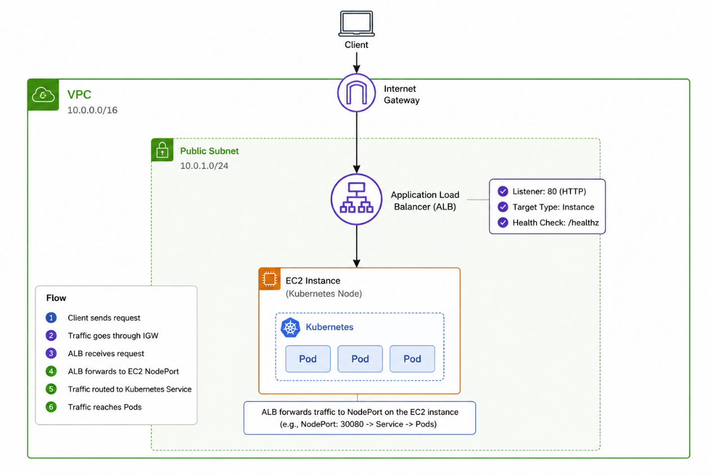
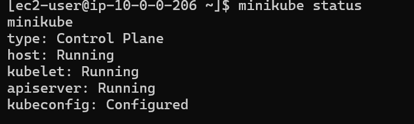
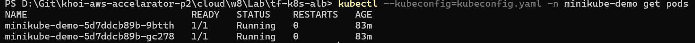
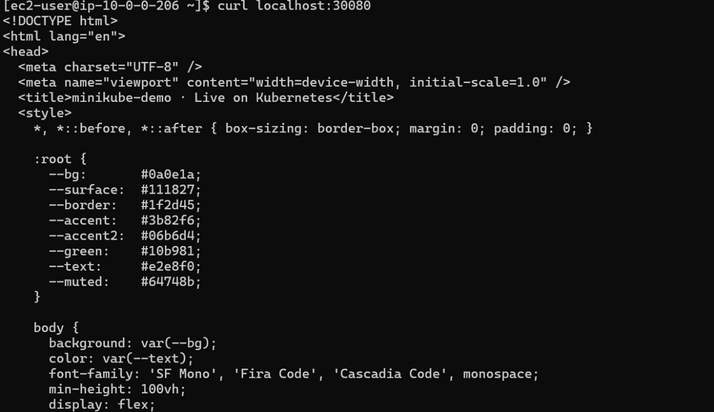
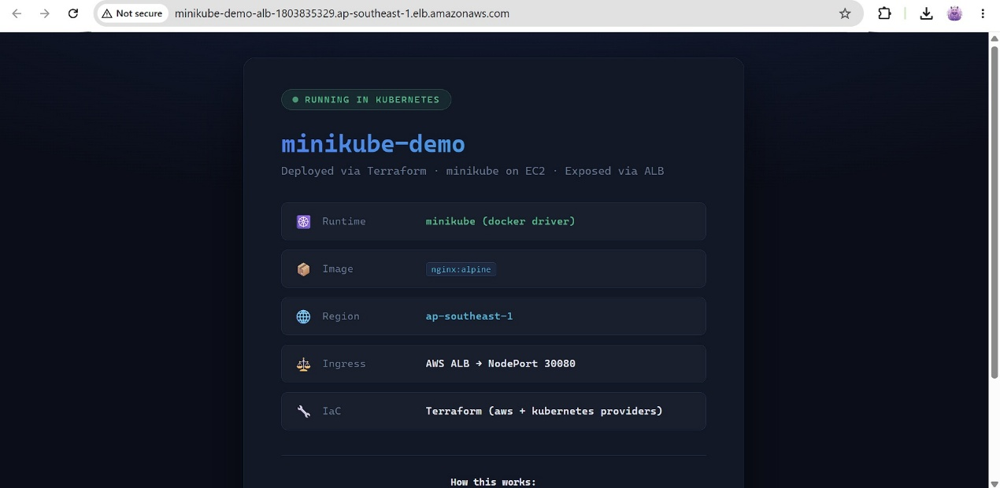
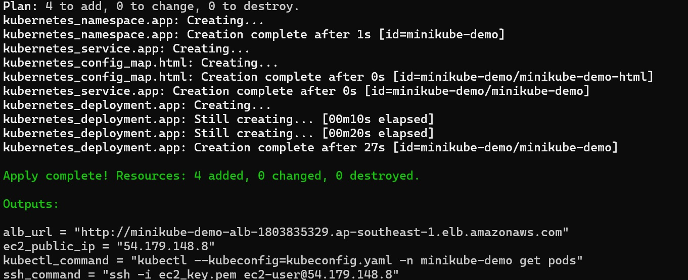

\# Evidence Pack --- Capstone W8

\## 1. Tổng Quan Dự Án

\- Dự án này dùng Terraform để dựng hạ tầng trên AWS, tạo một EC2
instance, chạy cụm Kubernetes bằng minikube bên trong EC2, deploy một
ứng dụng Node.js nhỏ vào Kubernetes, sau đó expose ứng dụng ra Internet
thông qua Application Load Balancer (ALB).

\- Các thành phần chính:

\+ Terraform tạo VPC, public subnet, Internet Gateway, route table,
security group, EC2, ALB, target group và listener.

\+ EC2 tự bootstrap bằng \`user_data\` khi khởi động.

\+ Minikube chạy trên EC2 bằng Docker driver.

\+ Ứng dụng chạy trong Kubernetes Pod, không cài trực tiếp trên EC2.

\+ ALB forward traffic vào EC2 port \`30080\`.

\+ Kubernetes Service dùng loại \`NodePort\` để đưa traffic vào Pod.

\+ Terraform sử dụng 2 providers: \`hashicorp/aws\` và
\`hashicorp/tls\`.

\- Dự án này dựng một hệ thống hoàn chỉnh từ \*\*1 lệnh duy nhất\*\*:

\`\`\`bash

terraform apply -auto-approve

\`\`\`

Terraform tự động tạo toàn bộ hạ tầng AWS, bootstrap Kubernetes cluster
bằng minikube trên EC2, deploy ứng dụng nginx vào Kubernetes, và expose
ra Internet thông qua Application Load Balancer.

\### Kết quả đầu ra

\`\`\`

Outputs:

alb_url =
\"http://minikube-demo-alb-1803835329.ap-southeast-1.elb.amazonaws.com\"

ec2_public_ip = \"54.179.148.8\"

ssh_command = \"ssh -i ec2_key.pem ec2-user@54.179.148.8\"

kubectl_command = \"kubectl \--kubeconfig=kubeconfig.yaml -n
minikube-demo get pods\"

\`\`\`

\-\--

\## 2. Kiến Trúc Hệ Thống

{width="5.7625in" height="3.841666666666667in"}

Luồng traffic:

Browser → ALB:80 → EC2:30080 → socat → minikube:30080 → nginx pod:80

\### Security Groups

\| SG \| Inbound \| Source \|

\|\-\--\|\-\--\|\-\--\|

\| \`alb-sg\` \| TCP 80 \| 0.0.0.0/0 \|

\| \`k8s-node-sg\` \| TCP 30080 \| alb-sg \|

\| \`k8s-node-sg\` \| TCP 22 \| 0.0.0.0/0 (bootstrap) \|

\| \`k8s-node-sg\` \| TCP 8443 \| 0.0.0.0/0 (K8s API) \|

\## 3. Cấu Trúc File

\`\`\`bash

tf-k8s-alb/

├── main.tf \# Orchestration: providers, modules, bootstrap, K8s
resources

├── variables.tf \# Input variables

├── outputs.tf \# ALB URL, SSH command, kubectl command

├── app/

│ └── index.html.tpl \# Custom HTML template (inject ALB URL, region)

├── scripts/

│ └── bootstrap.sh \# Cài Docker + minikube trên EC2 qua remote-exec

└── modules/

├── networking/ \# VPC, 2 subnets (2 AZ), IGW, route table, 2 SGs

│ ├── main.tf

│ ├── variables.tf

│ └── outputs.tf

├── compute/ \# EC2 t3.medium, gp3 20GB, Amazon Linux 2023

│ ├── main.tf

│ ├── variables.tf

│ └── outputs.tf

└── alb/ \# ALB + Target Group (health check /) + Listener :80

├── main.tf

├── variables.tf

└── outputs.tf

\`\`\`

\## 4. Quá Trình Thực Hiện

\### Bước 1 --- Khởi tạo

\`\`\`bash

terraform init

terraform apply -auto-approve

\`\`\`

\### Bước 2 --- Bootstrap EC2

\`scripts/bootstrap.sh\` chạy tự động qua \`remote-exec\`:

\`\`\`

dnf install docker \--allowerasing

systemctl enable \--now docker

install kubectl /usr/local/bin/kubectl

install minikube /usr/local/bin/minikube

minikube start \--driver=docker \\

\--apiserver-port=8443 \\

\--apiserver-ips=\<EC2_PUBLIC_IP\> \\

\--listen-address=0.0.0.0 \\

\--cpus=2 \--memory=2048 \--wait=all

\`\`\`

\### Bước 3 --- Fetch Kubeconfig

\`\`\`powershell

ssh ec2-user@EC2_IP \"kubectl config view \--flatten \--minify\" \\

\> kubeconfig_raw.yaml

\# Patch IP: 192.168.49.2 → 127.0.0.1 (qua SSH tunnel)

(Get-Content kubeconfig_raw.yaml) -replace
\'192\\.168\\.49\\.2\',\'127.0.0.1\' \\

\| Out-File kubeconfig.yaml -Encoding ascii

\`\`\`

\### Bước 4 --- Deploy Kubernetes Resources

\`\`\`bash

kubernetes_namespace minikube-demo

kubernetes_config_map minikube-demo-html (custom nginx HTML)

kubernetes_deployment 2 replicas nginx:alpine

kubernetes_service NodePort :30080 → pod :80

\`\`\`

\`\`\`bash

NAME READY STATUS RESTARTS AGE

minikube-demo-5d7ddcb89b-9btth 1/1 Running 0 106s

minikube-demo-5d7ddcb89b-gc278 1/1 Running 0 106s

\`\`\`

\### Bước 5 --- Expose NodePort ra Host EC2

\`\`\`bash

sudo socat TCP-LISTEN:30080,fork,reuseaddr TCP:192.168.49.2:30080 &

\`\`\`

\## 5. Kết Quả Deploy

\### Minikube Status

{width="5.772222222222222in"
height="1.726388888888889in"}

\### Pods đang chạy

{width="5.772222222222222in" height="0.36875in"}

\### Curl từ trong EC2 xác nhận app live

{width="5.772222222222222in"
height="3.326388888888889in"}

\### ALB URL

\`\`\`

http://minikube-demo-alb-1803835329.ap-southeast-1.elb.amazonaws.com

\`\`\`

{width="5.769444444444445in"
height="2.8152777777777778in"}

\### Apply complete

{width="5.769444444444445in"
height="2.3541666666666665in"}

\## 6. Dọn Dẹp

\`\`\`bash

terraform destroy -auto-approve

\# Destroy complete! Resources: 22 destroyed.

\`\`\`
